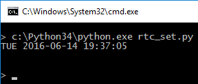
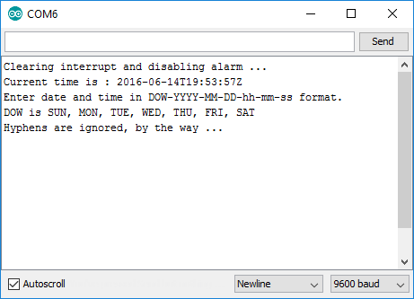

# rtc_set

## Motivation

Motivation to write this program is that setting exact time to RTC clock
is nearly impossible due to resets when serial connection is initiated.

UTC time is used because few of my Arduinos are going to serve as data logger
and I don't want to care about daylight saving time.

It clears RTC alarms and resets interrupt as well.

## Installation / Dependencies

Program needs Python with PySerial library installed. Installing PySerial is easy.
```
c:
cd \python34
scripts\pip.exe install pyserial
```

## Usage

- Open rtc_set.ino in Arduino IDE and upload it
- Close serial monitor in Arduino IDE
- Change serial port in rtc_set.py if needed
- Run the script

## Screenshots
 
Running Python script:<br>


Serial console, it's there for testing and verification:<br>



  
